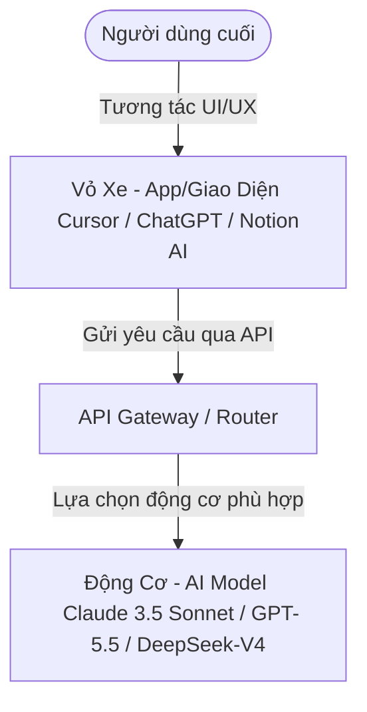
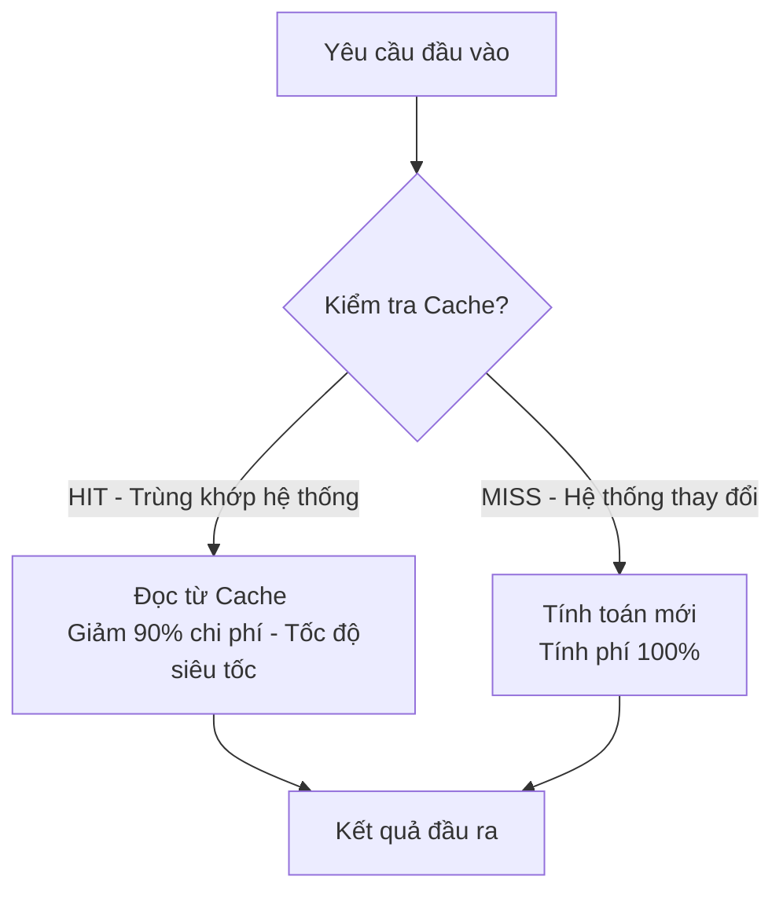

# 🧠 Nghiên AI - Bản đồ Thực chiến Mô hình AI (AI Model Playbook 2026)

Đây là cẩm nang tra cứu và bản đồ thực chiến về thị trường Mô hình AI (AI Models) của Nghiên AI. Tài liệu giúp bạn phân biệt rõ ràng giữa **Động cơ (Model)** và **Vỏ xe (App/Tool)**, cập nhật các mô hình mới nhất (giữa năm 2026), phân loại chi tiết theo từng phương thức dữ liệu (modality) và ánh xạ trực tiếp đến các ứng dụng thực tiễn để bạn áp dụng trực tiếp vào công việc.

---

## 🧭 PHẦN 1: HỆ THỐNG XẾP HẠNG & TRA CỨU AI THỜI GIAN THỰC
*Mục tiêu: Cung cấp các công cụ kiểm định để người dùng tự cập nhật thứ hạng các mô hình.*
*   **1.1. AI Arena (LMSYS)**: [https://arena.ai/leaderboard/agent](https://arena.ai/leaderboard/agent) — Phương pháp kiểm định mù (Blind Test) $\rightarrow$ Đo lường độ "khôn" thực tế của chatbot theo cảm nhận của người dùng.
*   **1.2. Artificial Analysis**: [https://artificialanalysis.ai/](https://artificialanalysis.ai/) — Đánh giá tốc độ xử lý (Tokens/giây), độ trễ (latency) và tối ưu hóa chi phí API.
*   **1.3. LLM Stats**: [https://llm-stats.com/](https://llm-stats.com/) — Tra cứu nhanh dung lượng bộ nhớ (context window) và thông số kỹ thuật.
*   **1.4. No-Cost AI Directory**: [https://github.com/zebbern/no-cost-ai](https://github.com/zebbern/no-cost-ai) — Tổng hợp các cổng trải nghiệm mô hình AI miễn phí.

---

## 🗺️ PHẦN 2: TƯ DUY NỀN TẢNG: ĐỘNG CƠ (MODEL) VS. VỎ XE (APP)
*Mục tiêu: Giúp người đọc phân biệt rõ lõi công nghệ và ứng dụng giao diện.*

### 2.1. Phép so sánh trực quan
*   **Động cơ (Model AI/API)**: Lõi xử lý, thuật toán và tri thức được huấn luyện trên siêu máy tính. (Ví dụ: Claude 3.5 Sonnet, GPT-5.5).
*   **Vỏ xe (Application/Giao diện)**: Phần mềm, giao diện tương tác trực tiếp với người dùng cuối, được tích hợp bộ não từ lớp Động cơ qua API. (Ví dụ: Cursor, Notion AI, ChatGPT).



### 2.2. Lựa chọn chiến lược
*   **Closed-source (Mô hình độc quyền)**: Trả phí theo lượt dùng, tính năng thương mại tối ưu sẵn, chạy trên đám mây của hãng (OpenAI, Anthropic, Google).
*   **Open-weights (Mã nguồn mở)**: Tải file trọng số về tự chạy offline trên phần cứng của bạn, bảo mật tuyệt đối, hoàn toàn miễn phí vận hành (Llama, Qwen, DeepSeek).

---

## 💡 PHẦN 3: HIỂU ĐÚNG BẢN CHẤT CỦA AI MODEL & TƯ DUY ORCHESTRATION

### 3.1. AI Model không phải là CSDL tri thức, AI là "Thực tập sinh thụ động"
Một sai lầm phổ biến là coi mô hình AI như một công cụ tìm kiếm hoặc cơ sở dữ liệu câu trả lời (Search Engine / Database). Thực chất:
*   **AI là Động cơ Lập luận Nhận thức (Cognitive Reasoning Engine)**: AI không "nhớ" thông tin theo dạng lưu trữ tệp, nó dự đoán token tiếp theo dựa trên các mẫu thống kê. Nếu bạn bắt AI nhớ những chi tiết vụn vặt không có sẵn trong context, nó sẽ tự động "bịa" (hallucination) để làm hài lòng bạn.
*   **AI là Thực tập sinh Thụ động có năng lực (Capable Passive Intern)**: AI cực kỳ thông minh nhưng lười biếng và không có chủ kiến chủ động. Nó cần có tài liệu tham khảo cụ thể (**Context**), chỉ dẫn chi tiết (**Prompt**), và đôi tay để thực thi (**Tools/Skills**).

### 3.2. Sự thật 2026: AI Model đã "đủ thông minh" cho 95% tác vụ văn phòng
Đến năm 2026, các mô hình AI tầm trung và giá rẻ (như Gemini 3.5 Flash, GPT-5.4 Mini, DeepSeek-V4-Flash) đã hoàn toàn vượt qua ngưỡng thông minh cần thiết để xử lý 95% công việc văn phòng thông thường (soạn thảo email, tổng hợp báo cáo tài chính, dịch tài liệu, phân loại dữ liệu bảng biểu). 
*   **Nút thắt cổ chai không còn nằm ở IQ của AI**: Việc chờ đợi các model thông minh hơn như GPT-6 hay Claude 5 không còn mang lại nhiều lợi nhuận đột phá cho doanh nghiệp.
*   **Kỷ nguyên của Orchestration (Điều phối)**: Sự khác biệt giữa một kết quả xuất sắc và một kết quả rác nằm ở cách chúng ta **thiết kế quy trình làm việc**, kết hợp các mô hình với nhau, cung cấp ngữ cảnh chính xác và tối ưu hóa chi phí.

```mermaid
graph TD
    subgraph Lớp Điều Phối (Orchestration Layer)
        C[Context - Ngữ cảnh / RAG] --> O[OUTPUT]
        P[Prompt - Chỉ dẫn hệ thống] --> O
        T[Tools/Skills - Đôi tay thực thi] --> O
    end
    M[Model - Bộ não AI] -->|Cung cấp sức mạnh lập luận| O
    
    style O fill:#FF623B,stroke:#000,stroke-width:2px,color:#fff
```

---

## 🌟 PHẦN 4: BẢN ĐỒ PHÂN LOẠI MÔ HÌNH THEO ĐA PHƯƠNG THỨC RỘNG (MULTIMODAL MODALITIES)
*Mục tiêu: Phân rã toàn bộ thế giới mô hình AI theo đầy đủ các phương thức dữ liệu chuyên sâu (dựa trên hệ thống phân loại Hugging Face).*

### 4.1. Text & Code (Văn bản & Lập trình - Natural Language Processing)
*   **Text-to-Text & Text-to-Code**: GPT-5.5 (OpenAI), Claude 4.8 Opus (Anthropic), Gemini 3.5 Flash (Google), DeepSeek-V4-Pro (DeepSeek).
*   **Document Question Answering (Hỏi đáp tài liệu dài)**: Gemini 3.1 Pro với bộ nhớ siêu khủng 2 triệu tokens.
*   **Code Generation (Tối ưu sinh mã nguồn)**: Claude 3.5 Sonnet và Qwen 2.5 Coder (Alibaba).
*   **Zero-Shot Classification & Text Ranking (Phân loại và xếp hạng văn bản)**: Các model chuyên biệt nhỏ phục vụ tìm kiếm ngữ nghĩa (Embedding & Reka).

### 4.2. Image (Hình ảnh & Thiết kế đồ họa - Computer Vision)
*   **Text-to-Image (Văn bản $\rightarrow$ Ảnh)**: Midjourney v6 (đỉnh cao thẩm mỹ), DALL-E 3 (hiểu prompt tốt, trong ChatGPT).
*   **Image-to-Image / Inpainting (Chỉnh sửa ảnh/Thêm bớt chi tiết)**: FLUX.1 (vẽ tay & viết chữ cực chuẩn), Stable Diffusion (tùy biến sâu cho dân chuyên nghiệp).
*   **Image Classification / Object Detection (Nhận diện vật thể & Phân loại hình ảnh)**: Các mô hình thị giác máy tính hỗ trợ kiểm tra chất lượng sản phẩm, xe tự lái.

### 4.3. Video (Phim ảnh & Chuyển động - Computer Vision)
*   **Text-to-Video (Văn bản $\rightarrow$ Video)**: OpenAI Sora, Veo 3.1 (Google).
*   **Image-to-Video (Ảnh tĩnh $\rightarrow$ Chuyển động)**: Runway Gen-3 Alpha (vàng trong làm phim), Kling AI, Luma Dream Machine.
*   **Video-to-Video (Thay đổi phong cách video gốc)**: Runway, DomoAI.
*   **Video Classification & Tracking (Phân loại & Theo dõi hành vi trong Video)**: Ứng dụng trong camera an ninh thông minh và phân tích thể thao.

### 4.4. Sound & Audio (Giọng nói & Âm thanh)
*   **Text-to-Speech (Văn bản $\rightarrow$ Giọng đọc)**: ElevenLabs (nhân bản giọng nói Voice Cloning có cảm xúc).
*   **Automatic Speech Recognition (Nhận dạng giọng nói thành văn bản)**: OpenAI Whisper, Google Speech-to-Text.
*   **Audio-to-Audio / Text-to-Audio (Nhạc & Hiệu ứng)**: Suno v4, Udio 1.5 (sáng tác bài hát), ElevenLabs SFX (tạo tiếng động môi trường).

### 4.5. Tabular & Time Series (Bảng biểu & Dự báo chuỗi thời gian)
*   **Tabular Classification / Regression (Phân tích dữ liệu bảng Excel/SQL)**: Các mô hình chuyên dự báo doanh thu, chấm điểm tín dụng tài chính.
*   **Time Series Forecasting (Dự báo chuỗi thời gian)**: Chronos (Amazon), Lag-Llama (dự báo xu hướng chứng khoán, thời tiết, nhu cầu thị trường).

### 4.6. 3D & Spatial AI (Không gian 3D & Vật lý ảo)
*   **Text-to-3D / Image-to-3D (Văn bản/Hình ảnh $\rightarrow$ Đối tượng 3D)**: Tripo3D, Meshy (xuất file mô hình 3D cho thiết kế game).
*   **Depth Estimation (Ước tính chiều sâu không gian)**: Mô hình hỗ trợ kính VR/AR (Apple Vision Pro) và robot định vị không gian vật lý.

### 4.7. Multimodal Any-to-Any (Bất kỳ đầu vào $\rightarrow$ Bất kỳ đầu ra)
*   **Any-to-Any Models**: Thế hệ mô hình nhận đầu vào gồm cả Text, Audio, Video đồng thời và xuất trực tiếp kết quả tương ứng không qua các bước chuyển trung gian (ví dụ: Gemini Live, GPT-4o Real-time Audio).

### 4.8. Reinforcement Learning & Robotics (Học tăng cường & Robot tự hành)
*   **Reinforcement Learning (Học tăng cường)**: Thuật toán huấn luyện AI tự chơi game, tự tối ưu hóa hệ thống máy chủ.
*   **Robotics Models**: Mô hình VLA (Vision-Language-Action) như RT-2 (Google), Figure-01 giúp robot nhận diện môi trường xung quanh và thực thi hành động vật lý (cầm nắm, sắp xếp đồ vật).

---

## 💰 PHẦN 5: CHI PHÍ AI MODEL & KỸ THUẬT TỐI ƯU HÓA 40-85% NGÂN SÁCH

Giá API đã giảm sâu vào năm 2026, tuy nhiên, nếu không tối ưu hóa, chi phí xử lý dữ liệu lớn sẽ nhanh chóng nuốt chửng lợi nhuận của bạn. Dưới đây là phân nhóm chi phí và kỹ thuật tối ưu hóa hàng đầu:

### 5.1. Bảng giá trị kinh tế của các phân khúc Model (Giá trên 1 triệu Tokens)
*   **Flagship / Reasoning Models (Claude 4.8 Opus, GPT-5.5)**: Vào: $3.00 - $5.00 / Ra: $10.00 - $15.00. (Dành cho lập luận phức tạp, code hệ thống).
*   **Flash / Mini Models (Gemini 3.5 Flash, GPT-5.4 Mini)**: Vào: $0.075 - $0.15 / Ra: $0.30 - $0.60. (Giá rẻ hơn tới **100 lần**, tốc độ cực nhanh, dành cho các tác vụ lặp lại).
*   **DeepSeek V4 Pro**: Vào: $0.14 / Ra: $0.28 (Tốc độ suy luận sâu nhưng giá chỉ tiệm cận phân khúc Flash của Mỹ).

### 5.2. Kỹ thuật 1: Prompt Caching (Lưu Cache Ngữ Cảnh) - Tiết kiệm đến 90% chi phí
Prompt Caching lưu lại trạng thái tính toán của các phần prompt cố định (System Prompt, hướng dẫn RAG, tài liệu mẫu) để tránh AI phải tính toán lại từ đầu trong các lượt chat tiếp theo.



*   **Nguyên tắc "Stable First, Variable Last" (Cố định trước, Biến thiên sau)**: Để hệ thống nhận diện cache thành công, các phần cố định như System Prompt, luật viết code phải được đặt ở **ĐẦU** tệp prompt. Bất kỳ thông tin biến động nào (như câu hỏi hiện tại của người dùng) phải được đặt ở **CUỐI CÙNG**. Nếu đặt biến thiên ở giữa, toàn bộ phần cache phía sau sẽ bị invalid.

### 5.3. Kỹ thuật 2: Model Routing (Điều phối dòng máy) - Tiết kiệm đến 85% chi phí
Không sử dụng dao mổ trâu để giết gà. Hãy phân loại yêu cầu người dùng trước khi gửi đến AI:
1.  **Tác vụ Đơn giản (Classification, Formatting, Translation)**: Tự động chuyển qua **Gemini 3.5 Flash / GPT-5.4 Mini** để xử lý nhanh và rẻ.
2.  **Tác vụ Phức tạp (Coding, System Design, Logic)**: Chuyển qua **Claude 3.5 Sonnet / GPT-5.5**.

---

## 🏢 PHẦN 6: DANH BẠ VÀ PHÂN KHÚC MODEL CHI TIẾT CỦA 50+ CÔNG TY AI TOÀN CẦU

Dưới đây là danh sách 52 công ty và phòng thí nghiệm (Research Labs) phát triển mô hình AI hàng đầu thế giới, đi kèm phân khúc model chi tiết của 4 thế lực lớn nhất:

### 🌟 4 TẬP ĐOÀN DẪN ĐẦU & PHÂN KHÚC CHI TIẾT (CẬP NHẬT 2026)

#### 1. Anthropic (Dòng Claude)
*Trụ sở: Mỹ | Website: https://anthropic.com | Giao diện: [Claude.ai](https://claude.ai)*
*   **Claude 3.5 Haiku (Phân khúc Giá rẻ/Tốc độ - Mini)**: 
    *   *Chi phí*: Siêu rẻ (~$0.08/1M tokens đầu vào).
    *   *Đặc điểm*: Tốc độ phản hồi cực nhanh, chuyên xử lý các hành động tự động hàng loạt (Agentic actions) và phân loại dữ liệu.
*   **Claude 3.5 Sonnet (Phân khúc Trung cấp/Lập trình - Standard)**:
    *   *Chi phí*: Trung bình (Vào: $3.00 / Ra: $15.00).
    *   *Đặc điểm*: "Tiêu chuẩn vàng" của dân lập trình toàn cầu. Dẫn đầu về viết code sạch, thiết kế hệ thống và sửa lỗi logic mà không bị ảo tưởng (hallucinate).
*   **Claude 4.8 Opus (Phân khúc Flagship/Suy luận Cao cấp - Pro)**:
    *   *Chi phí*: Cao cấp (Vào: $5.00 / Ra: $15.00).
    *   *Đặc điểm*: Ra mắt tháng 5/2026. Tích hợp tính năng "Adaptive Thinking" (Tư duy thích ứng) cho phép AI tùy biến chiều sâu suy luận theo bài toán, hỗ trợ bộ nhớ 1 triệu tokens. Dành cho nghiên cứu khoa học, phân tích thị trường phức tạp.
*   **Claude 5 Fable & Claude 5 Mythos (Phân khúc Tương lai/Frontier)**:
    *   *Đặc điểm*: Các mô hình thế hệ tiếp theo vượt trội Opus. Hiện tại **đang bị tạm dừng cung cấp trên toàn cầu** (từ ngày 12/6/2026) theo lệnh của chính phủ Mỹ để kiểm tra an toàn quốc gia.

#### 2. OpenAI (Dòng GPT & o-series)
*Trụ sở: Mỹ | Website: https://openai.com | Giao diện: [ChatGPT](https://chatgpt.com)*
*   **GPT-5.4 Mini (Phân khúc Giá rẻ/Tự động hóa - Mini)**:
    *   *Chi phí*: Siêu rẻ ($0.075/1M tokens).
    *   *Đặc điểm*: Thay thế GPT-4o-mini, tối ưu cho dịch thuật, tóm tắt và tự động hóa quy trình lặp lại.
*   **GPT-5.5 (Phân khúc Flagship Đa phương thức - Standard/Pro)**:
    *   *Chi phí*: Phân khúc cao cấp (Vào: $2.50 / Ra: $10.00).
    *   *Đặc điểm*: Ra mắt tháng 4/2026, là model mặc định trong ChatGPT Plus, xử lý văn bản, ảnh, âm thanh đồng thời cực mạnh với khả năng lập luận đa chiều xuất sắc.
*   **GPT-5.6 (Phân khúc Cao cấp Tương lai)**:
    *   *Đặc điểm*: Phiên bản đang được thử nghiệm nội bộ, dự kiến ra mắt cuối tháng 6/2026 để cạnh tranh trực tiếp với Claude 4.8 Opus.
*   *Lưu ý*: Dòng mô hình suy luận chuyên biệt **o3** và **GPT-4.5** đã bước vào giai đoạn ngừng hoạt động (sunset), chính thức đóng quyền truy cập vào ngày 26/8/2026.

#### 3. Google DeepMind (Dòng Gemini)
*Trụ sở: Mỹ | Website: https://deepmind.google | Giao diện: [Gemini Web](https://gemini.google.com)*
*   **Gemini 3.1 Flash-Lite (Phân khúc Siêu tiết kiệm - Nano)**:
    *   *Chi phí*: Rẻ nhất thế giới (chỉ vài xu cho 1 triệu tokens).
    *   *Đặc điểm*: Phục vụ lọc spam, trích xuất thực thể từ văn bản thô với khối lượng khổng lồ.
*   **Gemini 3.5 Flash (Phân khúc Workhorse Đa năng - Standard)**:
    *   *Chi phí*: Siêu rẻ (Vào: $0.075 / Ra: $0.30).
    *   *Đặc điểm*: Ra mắt tháng 5/2026, dòng model chính của các nhà lập trình. Dẫn đầu về tỷ lệ Hiệu năng/Chi phí, hỗ trợ 1 triệu tokens, phản hồi cực nhạy.
*   **Gemini 3.1 Pro (Phân khúc Bộ nhớ Siêu khủng - Pro)**:
    *   *Chi phí*: Phân khúc cao cấp (Vào: $1.25 / Ra: $5.00).
    *   *Đặc điểm*: Sở hữu bộ nhớ Context Window lên tới 2 triệu tokens (lớn nhất hành tinh), chuyên dùng để đọc cả thư viện sách, phân tích tệp video giám sát dài vài tiếng hoặc hàng chục vạn dòng code.

#### 4. DeepSeek (Dòng V & R)
*Trụ sở: Trung Quốc | Website: https://deepseek.com | Giao diện: [DeepSeek Chat](https://chat.deepseek.com)*
*   **DeepSeek-V4-Flash (Phân khúc Siêu tốc độ - Flash)**:
    *   *Chi phí*: Gần như miễn phí, hỗ trợ context 1 triệu tokens.
    *   *Đặc điểm*: Mô hình MoE nhỏ cực kỳ linh hoạt để thay thế các mô hình Flash của Mỹ.
*   **DeepSeek-V4-Pro (Phân khúc Suy luận Đa dụng - Flagship)**:
    *   *Chi phí*: Rẻ kinh ngạc (Vào: $0.14 / Ra: $0.28).
    *   *Đặc điểm*: Mô hình flagship MoE 1.6T parameter ra mắt tháng 4/2026. Đạt hiệu năng suy luận sâu và viết code tương đương các model Mỹ nhưng giá rẻ hơn gấp 10 lần.
*   **DeepSeek-R1 (Phân khúc Suy luận thuần túy - Reasoning)**:
    *   *Đặc điểm*: Dòng mô hình mở tạo bước ngoặt lớn về suy nghĩ logic phức tạp thông qua cơ chế tự học (Reinforcement Learning).

---

### 🇺🇸 Các nhà phát triển khác tại Hoa Kỳ (US AI Companies)
5.  **Meta AI**: https://meta.ai — Phát triển dòng mô hình mã nguồn mở Llama (Llama 3 8B/70B/405B).
6.  **Microsoft AI**: https://microsoft.com — Đồng phát triển dòng mô hình nhỏ Phi và các mô hình doanh nghiệp MAI.
7.  **Cohere**: https://cohere.com — Tập trung vào các mô hình cho doanh nghiệp (Command R+).
8.  **Runway**: https://runwayml.com — Tiên phong trong lĩnh vực AI tạo video (Gen-2, Gen-3 Alpha).
9.  **Midjourney**: https://midjourney.com — Dẫn đầu về tạo hình ảnh nghệ thuật chất lượng cao.
10. **Luma AI**: https://lumalabs.ai — Phát triển mô hình tạo video Dream Machine và tái tạo 3D.
11. **ElevenLabs**: https://elevenlabs.io — Vua tạo giọng nói AI và nhân bản giọng đọc.
12. **Suno AI**: https://suno.com — Tiên phong tạo nhạc tự động hoàn chỉnh từ văn bản.
13. **Udio**: https://udio.com — Đối thủ trực tiếp của Suno trong lĩnh vực sáng tác nhạc AI.
14. **Character.ai**: https://character.ai — Chuyên về các mô hình ngôn ngữ lớn đóng vai nhân vật (Roleplay).
15. **Hugging Face**: https://huggingface.co — Nền tảng chia sẻ model mở lớn nhất thế giới, phát triển dòng mô hình nhỏ SmolLM.
16. **IBM**: https://ibm.com — Phát triển dòng mô hình Granite phục vụ cho doanh nghiệp.
17. **Amazon Web Services**: https://aws.amazon.com — Phát triển dòng mô hình Titan tích hợp trên đám mây AWS.
18. **Apple**: https://apple.com — Nghiên cứu các mô hình mở chạy cục bộ (OpenELM, Ferret).
19. **Nvidia**: https://nvidia.com — Phát triển dòng mô hình Nemotron để tối ưu hóa trên phần cứng GPU của hãng.
20. **AI21 Labs**: https://ai21.com — Lab nghiên cứu của Israel/Mỹ phát triển mô hình Jamba (kiến trúc lai SSM/Transformer).
21. **Reka AI**: https://reka.ai — Công ty phát triển mô hình đa phương thức Reka Core/Flash/Edge.
22. **Imbue**: https://imbue.com — Lab chuyên nghiên cứu mô hình có khả năng suy luận logic để viết code.
23. **Inflection AI**: https://inflection.ai — Từng nổi tiếng với mô hình Pi thân thiện, hiện tập trung vào giải pháp doanh nghiệp.
24. **Adept AI**: https://adept.ai — Phát triển các mô hình hành động (Action models) tự động điều khiển máy tính.
25. **Pika Labs**: https://pika.art — Công ty startup tạo video AI (Pika v2).
26. **Ideogram**: https://ideogram.ai — Công ty của Canada/Mỹ chuyên tạo ảnh tập trung vào viết chữ nghệ thuật.
27. **SambaNova Systems**: https://sambanova.ai — Cung cấp chip AI và phát triển mô hình chuyên biệt Samba-CoE.
28. **Together AI**: https://together.ai — Cung cấp hạ tầng đám mây và tinh chỉnh các mô hình mở.
29. **Decart**: https://decart.ai — Phát triển mô hình sinh thế giới động (Oasis) theo thời gian thực.
30. **Haiper AI**: https://haiper.ai — Phát triển mô hình tạo video chuyển động.
31. **Hedra**: https://hedra.com — Chuyên về mô hình tạo nhân vật ảo nói chuyện khớp khẩu hình (Lipsync).
32. **Deforum**: https://deforum.github.io — Cộng đồng phát triển mô hình tạo hoạt ảnh Stable Diffusion.

### 🇨🇳 Các nhà phát triển tại Trung Quốc (China AI Companies)
33. **Moonshot AI**: Giao diện chat: [Kimi](https://kimi.ai) — Nổi tiếng với mô hình xử lý văn bản dài.
34. **Alibaba Cloud**: Website: https://qwen.ai — Nhà phát triển dòng mô hình mã nguồn mở Qwen.
35. **Zhipu AI (Trí Phổ)**: Website: https://zhipuai.cn — Phát triển dòng mô hình GLM tối ưu tiếng Việt/Trung cực tốt.
36. **MiniMax**: Website: https://minimax.io — Phát triển mô hình video Hailuo và giọng nói AI.
37. **Xiaomi**: Giao diện: [MiMo](https://mimo.mi.com) — Phát triển mô hình MiMo tích hợp sâu vào hệ điều hành HyperOS.
38. **StepFun (Giai Diệp)**: Website: https://stepfun.ai — Phát triển dòng mô hình đa phương thức Step-1/Step-2.
39. **Kuaishou Technology**: Giao diện: [Kling AI](https://klingai.com) — Đơn vị chủ quản của mô hình tạo video nổi tiếng Kling AI.
40. **ByteDance (Tiktok)**: Giao diện: [Doubao](https://doubao.com) — Phát triển dòng mô hình Doubao đa năng.
41. **Tencent**: Website: https://hunyuan.tencent.com — Phát triển dòng mô hình đa phương thức Hunyuan.
42. **Baidu**: Website: https://baidu.com — Ông lớn công nghệ phát triển dòng mô hình Ernie (Wenxin Yiyan).
43. **Baichuan AI (Bách Xuyên)**: Website: https://baichuan-ai.com — Startup phát triển mô hình ngôn ngữ lớn Baichuan.
44. **01.AI (Linh Nhất Vạn Vật)**: Website: https://01.ai — Công ty của Kai-Fu Lee phát triển dòng mô hình mã nguồn mở Yi.
45. **SenseTime (Thương Thang)**: Website: https://sensetime.com — Tập đoàn AI phát triển dòng mô hình doanh nghiệp SenseNova.

### 🇪🇺 Các nhà phát triển tại Châu Âu & Quốc tế (EU & APAC AI Companies)
46. **Mistral AI**: Website: https://mistral.ai — Giao diện: [Le Chat](https://chat.mistral.ai) — Startup Pháp phát triển dòng mô hình Mistral.
47. **Black Forest Labs**: Website: https://blackforestlabs.ai — Lab nghiên cứu của Đức phát triển mô hình ảnh FLUX.1.
48. **Sakana AI**: Website: https://sakana.ai — Lab của Nhật Bản nổi tiếng với việc tiến hóa mô hình bằng giải thuật sinh học.
49. **Stability AI**: Website: https://stability.ai — Lab của Anh phát triển dòng Stable Diffusion.
50. **DeepL**: Website: https://deepl.com — Lab của Đức dẫn đầu về các mô hình dịch thuật ngôn ngữ chuyên sâu.
51. **Aleph Alpha**: Website: https://aleph-alpha.com — Lab của Đức chuyên phát triển các mô hình AI bảo mật cho chính phủ và doanh nghiệp.
52. **Voicemod**: Website: https://voicemod.net — Lab của Tây Ban Nha chuyên về các mô hình giọng nói Audio-to-Audio thời gian thực.

---

## 🔗 PHẦN 7: BẢN ĐỒ ÁNH XẠ: TỪ BỘ NÃO ĐẾN ỨNG DỤNG THỰC TẾ
> [!IMPORTANT]
> **Lưu ý quan trọng**: Phần này tập trung vào sự kết nối giữa Mô hình gốc (Model) và các ứng dụng tiêu biểu. Chi tiết sâu về hệ sinh thái Công cụ (Tools), Giao thức kết nối (MCP), môi trường thực thi cục bộ (Sandbox) và cách tự xây dựng trợ lý riêng sẽ được Nghiên AI biên soạn cực kỳ chi tiết trong một bài viết/Workbook độc lập dành riêng cho **Video tiếp theo (Video 3 - Tools)**. Chúng tôi sẽ cập nhật liên kết trực tiếp tại đây ngay sau khi video được phát sóng.

*   **Cursor / Windsurf**: Sử dụng bộ não chính là **Claude 3.5 Sonnet** kết hợp GPT-5.5 / Gemini 3.1 Pro.
*   **v0.dev (Vercel)**: Sử dụng bộ não **Claude 3.5 Sonnet** để sinh frontend code.
*   **Microsoft Copilot**: Sử dụng bộ não **GPT-5.5** qua cổng tích hợp Office/Windows.
*   **Perplexity AI**: Cho phép người dùng tùy chọn não chạy ngầm (**GPT-5.5 / Claude 3.5 Sonnet / Sonar**).
*   **Notion AI**: Tích hợp song song bộ não **GPT-5.5** và **Claude 3.5 Sonnet**.

---

## ✍ PHẦN 8: KỸ THUẬT PROMPTING TƯƠNG THÍCH MÔ HÌNH (ANTI-SLOP RULES)
*Mục tiêu: Đưa ra chỉ dẫn viết prompt cụ thể thay vì các template chung chung vô dụng.*
*   **8.1. Kỹ thuật viết prompt cho dòng Claude**: Hướng dẫn phân rã thông tin bằng cấu trúc thẻ XML chuyên nghiệp.
*   **8.2. Kỹ thuật viết prompt cho dòng Suy luận (DeepSeek-R1 / o1)**: Hướng dẫn kỹ thuật "Zero System Prompt" để tránh can thiệp sâu vào luồng suy nghĩ `<think>` của AI.
*   **8.3. Bộ lọc chống văn phong "AI Slop" Tiếng Việt**: Đoạn mã prompt loại bỏ triệt để 21 từ ngữ rập khuôn, hoa mỹ vô nghĩa của AI để tạo ra nội dung thuần Việt tự nhiên.
