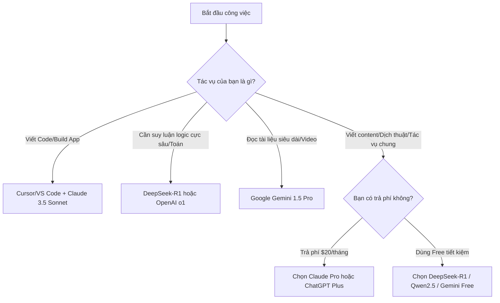

# 🧠 Nghiên AI - AI Models Workbook & Flagship Slides

Chào mừng bạn đến với kho lưu trữ thực chiến về chủ đề **AI Model** (Mô hình AI) của Nghiên AI! Đây là nơi lưu trữ mã nguồn slide trình chiếu động, bảng đối chiếu đa chiều và bộ chỉ dẫn System Prompt copy-paste dùng ngay.

## 📺 Xem Slide Trình Chiếu Trực Tuyến
Bạn có thể xem slide thuyết trình động (được xây dựng bằng HTML/CSS/JS, D3.js force network, GSAP animations) trực tiếp tại:
👉 **[Xem Slide Thuyết Trình (Video 2: Origins)](https://jackvi810.github.io/nghienai-slides/v2-model-origins/)**

*Mẹo: Nhấn phím mũi tên `Phải` / `Trái` hoặc phím `Space` trên bàn phím máy tính để xem từng bước hiệu ứng của slide.*

---

## 📊 AI Model Selection Matrix (Bảng tra cứu đa chiều)
Dưới đây là bảng đối chiếu nhanh 12 dòng mô hình AI nổi tiếng nhất thế giới hiện nay do Nghiên AI tổng hợp, giúp bạn nhanh chóng quyết định nên dùng mô hình nào cho công việc:

| Mô hình AI | Quốc gia | Trải nghiệm Web | Đơn giá API (1M Tokens) | Context Window (Bộ nhớ) | Thế mạnh cốt lõi | Lưu ý & Điểm yếu |
| :--- | :--- | :--- | :--- | :--- | :--- | :--- |
| **Claude 3.5 Sonnet** | Mỹ | [claude.ai](https://claude.ai) | Vào: $3.00 / Ra: $15.00 | 200,000 | Lập trình phần mềm, viết tài liệu kỹ thuật sạch, thiết kế UI/UX | Giới hạn số câu chat miễn phí mỗi ngày rất nhanh |
| **DeepSeek-R1** | Trung Quốc | [chat.deepseek.com](https://chat.deepseek.com) | Vào: $0.55 / Ra: $2.19 (Rẻ 6x) | 128,000 | Suy luận toán học phức tạp, giải quyết logic sâu, giá API cực rẻ | Tốc độ suy luận ban đầu có thể hơi chậm (phải chờ AI "suy nghĩ") |
| **Gemini 1.5 Pro** | Mỹ | [gemini.google.com](https://gemini.google.com) | Vào: $1.25 / Ra: $5.00 | 2,000,000 (Lớn nhất) | Phân tích video dài, đọc tài liệu dày hàng ngàn trang, phân tích đa phương thức | Giao diện web đôi khi xử lý văn bản tiếng Việt chưa mượt |
| **ChatGPT (GPT-4o)** | Mỹ | [chatgpt.com](https://chatgpt.com) | Vào: $2.50 / Ra: $10.00 | 128,000 | Đa dụng, phản hồi nhanh, hệ sinh thái Custom GPTs phong phú | Bản miễn phí giới hạn lượt dùng model mạnh và hay bị lặp ý |
| **Grok (xAI)** | Mỹ | [grok.com](https://grok.com) | Vào: $2.00 / Ra: $10.00 | 131,072 | Cập nhật tin tức thời gian thực trên mạng xã hội X (Twitter) | Đọc tài liệu dài chưa tối ưu bằng Claude và Gemini |
| **Llama (Meta)** | Mỹ | [meta.ai](https://meta.ai) | Tùy nhà cung cấp (Rất rẻ) | Tùy phiên bản | Mô hình mã nguồn mở (Open-weights) tốt nhất thế giới | Phải tự cài đặt cục bộ hoặc sử dụng qua bên thứ ba (Ollama, Groq) |
| **Moonshot Kimi** | Trung Quốc | [kimi.ai](https://kimi.ai) | Rẻ | 200,000 | Đọc và xử lý văn bản tiếng Trung/tiếng Việt dung lượng lớn | Chưa tối ưu cho lập trình phần mềm |
| **GLM (Zhipu AI)** | Trung Quốc | [chat.z.ai](https://chat.z.ai) | Rẻ | 128,000 | Hiệu năng tổng quát tốt, tối ưu tiếng Việt cực tốt | Hệ sinh thái SaaS chưa phổ biến ở phương Tây |
| **Alibaba Qwen** | Trung Quốc | [chat.qwen.ai](https://chat.qwen.ai) | Siêu rẻ | 32,768 | Mô hình mở mạnh mẽ ngang Llama, lập trình rất tốt | Bản Web chat chưa hoàn thiện bằng các đối thủ |
| **Xiaomi Mimo** | Trung Quốc | [mimo.mi.com](https://mimo.mi.com) | Nội bộ | - | Tích hợp sâu vào hệ điều hành MIUI/HyperOS | Chưa phân phối rộng rãi ra thị trường quốc tế |
| **MiniMax** | Trung Quốc | [minimax.io](https://www.minimax.io) | Rẻ | 128,000 | Sáng tạo nội dung, giọng nói AI, tương tác nhập vai | Phù hợp giải trí và viết sáng tạo hơn là làm việc văn phòng |

---

## 🌳 Sơ đồ Quyết định chọn Mô hình AI (Decision Tree)
Bạn phân vân không biết nên mở tab nào? Hãy đi theo sơ đồ phân loại nhanh sau:



---

## 📑 System Prompt Cards (Sao chép dùng ngay)

Dán các nội dung này vào phần **Custom Instructions (ChatGPT)** hoặc **System Prompt (API Playground / Cursor / Claude Projects)** để ép AI hành xử chuẩn xác, không bị "AI Slop" (nói nhiều, rườm rà, sáo rỗng):

### 1. Prompt Chống Sến Súa & Chống Rác AI (Dành cho Viết Content Tiếng Việt)
```text
Bạn là một Content Creator xuất sắc. Khi viết nội dung bằng Tiếng Việt, hãy tuân thủ nghiêm ngặt các quy tắc sau:
- KHÔNG sử dụng các từ sáo rỗng, rập khuôn của AI như: "Đột phá", "bạn đã bao giờ", "chào các bạn", "hãy cùng khám phá", "thực sự", "chắc chắn", "hứa hẹn".
- Xưng hô tự nhiên: "mình/bạn" hoặc "tôi/bạn". Không xưng "chúng tôi" trừ khi đại diện tổ chức lớn.
- Viết câu ngắn, rõ ràng, gãy gọn. Tối đa 25 từ mỗi câu.
- Tập trung vào tính thực tế, đưa ra giải pháp/số liệu/ví dụ cụ thể thay vì nói lý thuyết chung chung.
- Xuất bản định dạng Markdown tối giản (sử dụng list, in đậm từ khóa quan trọng).
```

### 2. Prompt Ép Mô Hình Suy Luận DeepSeek-R1 Định Dạng Bento/Markdown Sạch
```text
Khi trả lời câu hỏi, hãy sử dụng tính năng suy luận của bạn để tìm ra đáp án tối ưu nhất. Khi kết xuất kết quả:
- Trình bày thông tin dưới dạng Bento Grid (Bảng không có đường viền dọc, phân chia thẻ rõ ràng bằng đường kẻ ngang).
- Không viết những câu chào hỏi/kết bài thừa thãi (như "Hy vọng câu trả lời này giúp ích").
- Vào thẳng nội dung câu trả lời. Sử dụng emoji tinh tế ở đầu mỗi thẻ danh sách để tạo nhịp điệu đọc.
```

---

## 🛠️ Hướng dẫn Tải slide về chạy offline
Nếu bạn muốn lưu trữ slide này làm tài liệu học tập ngoại tuyến (offline) trên máy tính:
1.  Bấm vào nút **`Code`** (màu xanh lá cây) ở phía trên bên phải trang GitHub này $
ightarrow$ Chọn **`Download ZIP`**.
2.  Giải nén file ZIP vừa tải về.
3.  Click đúp chuột vào tệp **`index.html`** để chạy slide trực tiếp trên trình duyệt của bạn mà không cần kết nối Internet.

---
*Dự án được xây dựng và phát triển bởi cộng đồng **Nghiên AI**.*
