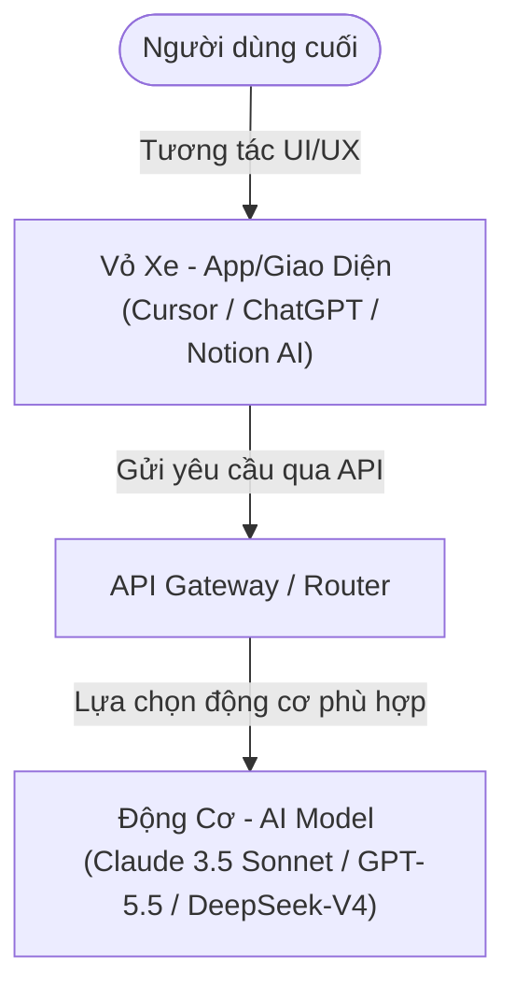
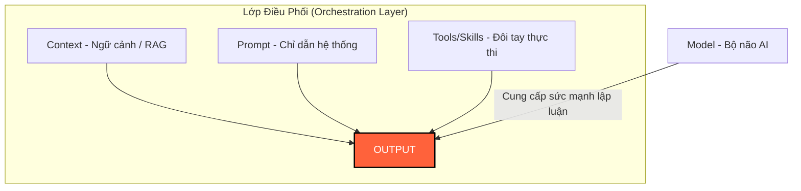
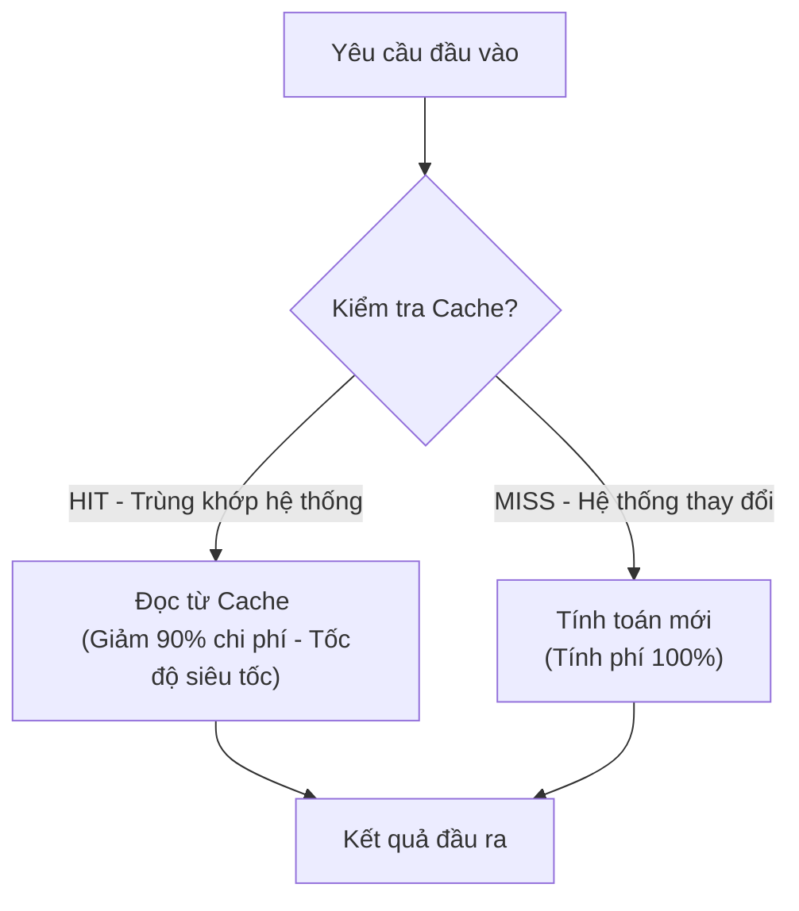

# 🧠 Nghiên AI - Bản đồ Thực chiến Mô hình AI (AI Model Playbook 2026)

Chào mừng bạn đến với cẩm nang tra cứu và bản đồ thực chiến về thị trường Mô hình AI (AI Models) do Nghiên AI tổng hợp. Tài liệu này được thiết kế như một bài blog/workbook chuyên sâu, giúp bạn phân biệt rõ ràng giữa bản chất của **Động cơ (Model)** và **Vỏ xe (App/Tool)**, cập nhật chi tiết các dòng mô hình mới nhất tính đến giữa năm 2026, phân loại đầy đủ các phương thức dữ liệu (modality) theo chuẩn quốc tế và hướng dẫn cách điều phối (orchestrate) cũng như tối ưu hóa chi phí API thực tế từ 40% đến 85%.

---

## 🧭 PHẦN 1: HỆ THỐNG XẾP HẠNG & TRA CỨU AI THỜI GIAN THỰC

Để không bị phụ thuộc vào các quảng cáo marketing thổi phồng từ các hãng công nghệ, bạn cần tự trang bị các công cụ kiểm định độc lập. Dưới đây là 4 trang web xếp hạng và tra cứu LLM uy tín nhất thế giới hiện nay:

1.  **AI Arena (LMSYS)**: [https://arena.ai/leaderboard/agent](https://arena.ai/leaderboard/agent)
    *   *Cách hoạt động*: Sử dụng phương pháp kiểm thử mù (Blind A/B Testing). Người dùng nhập một câu hỏi, hai mô hình ẩn danh sẽ trả lời bên cạnh nhau. Người dùng bình chọn câu trả lời tốt hơn $\rightarrow$ hệ thống tính điểm Elo như trong cờ vua.
    *   *Ý nghĩa thực tế*: Đây là thước đo chuẩn xác nhất về độ khôn thực tế của chatbot theo cảm nhận của con người, rất khó bị gian lận bởi các bài test học thuật (benchmarks) đã bị lộ đề.
2.  **Artificial Analysis**: [https://artificialanalysis.ai/](https://artificialanalysis.ai/)
    *   *Cách hoạt động*: Hệ thống liên tục đo lường hiệu năng kỹ thuật của các nhà cung cấp API lớn.
    *   *Ý nghĩa thực tế*: Giúp bạn tra cứu tốc độ sinh token (Tokens/giây), độ trễ phản hồi ký tự đầu tiên (Time-to-First-Token - TTFT) và so sánh trực quan hiệu năng trên giá tiền để tối ưu hóa hệ thống.
3.  **LLM Stats**: [https://llm-stats.com/](https://llm-stats.com/)
    *   *Cách hoạt động*: Cơ sở dữ liệu tổng hợp các thông số vật lý của mô hình.
    *   *Ý nghĩa thực tế*: Giúp tra cứu nhanh dung lượng bộ nhớ tối đa (context window), kích thước tham số thực tế và tốc độ tăng trưởng thị trường của các dòng LLM.
4.  **No-Cost AI Directory**: [https://github.com/zebbern/no-cost-ai](https://github.com/zebbern/no-cost-ai)
    *   *Ý nghĩa thực tế*: Thư mục mã nguồn mở tổng hợp tất cả các liên kết giúp người dùng phổ thông tiếp cận và trải nghiệm trực tiếp các mô hình AI cao cấp hoàn toàn miễn phí.

---

## 🗺️ PHẦN 2: TƯ DUY NỀN TẢNG: ĐỘNG CƠ (MODEL) VS. VỎ XE (APP)

Một trong những sai lầm phổ biến nhất của người mới học AI là đánh đồng ứng dụng giao diện và mô hình xử lý. Để làm chủ công nghệ, bạn cần phân rã chúng thành hai lớp riêng biệt:

### 2.1. Phân biệt Bản chất Kiến trúc

*   **Lớp Động cơ (AI Model / Foundation Model / API)**:
    *   Là bộ não trung tâm được lưu trữ dưới dạng các file trọng số (weights) khổng lồ, chạy trên các cụm máy chủ siêu máy tính chứa hàng chục ngàn chip GPU chuyên dụng.
    *   Nhiệm vụ: Chỉ thực hiện tính toán xác suất, nhận văn bản/hình ảnh đầu vào và trả về dự đoán chuỗi ký tự/điểm ảnh đầu ra.
    *   Ví dụ: *Claude 3.5 Sonnet, GPT-5.5, DeepSeek-V4-Pro, Llama 3 70B*.
*   **Lớp Vỏ xe (Application / Giao diện / UI / Wrapper)**:
    *   Là phần mềm, giao diện ứng dụng di động, trang web hoặc extension trình duyệt mà bạn tương tác hàng ngày.
    *   Nhiệm vụ: Nhận yêu cầu của người dùng, đóng gói thêm ngữ cảnh, gửi qua cổng API đến lớp Động cơ, nhận kết quả trả về và hiển thị đẹp mắt lên màn hình.
    *   Ví dụ: *Trình soạn thảo Cursor, trang web v0.dev, Notion AI, hay ChatGPT*.



*Bài học thực tế*: Tại sao cùng một bộ não *Claude 3.5 Sonnet* lại xuất hiện ở nhiều nơi? Vì Anthropic mở cổng API thương mại $\rightarrow$ Vercel mua API lắp vào **v0.dev** để sinh giao diện web, Cursor mua API lắp vào **Cursor Editor** để viết code, và người dùng phổ thông chat trực tiếp trên trang chủ **Claude.ai** do chính Anthropic quản lý.

### 2.2. Lựa chọn chiến lược: Độc quyền (Closed) vs. Mở (Open)

| Tiêu chí | Closed-source (Độc quyền) | Open-weights (Mã nguồn mở) |
| :--- | :--- | :--- |
| **Đại diện tiêu biểu** | OpenAI, Anthropic, Google | Meta (Llama), Alibaba (Qwen), DeepSeek |
| **Cách thức sử dụng** | Bắt buộc thông qua web hãng hoặc thuê API đám mây | Tải file trọng số về tự chạy hoặc thuê máy chủ đám mây độc lập |
| **Bảo mật dữ liệu** | Trung bình (Dữ liệu gửi lên server bên thứ ba) | Tuyệt đối (Chạy offline 100% không gửi dữ liệu ra ngoài) |
| **Chi phí cố định** | Thanh toán theo lượng token sử dụng thực tế | Miễn phí bản quyền, chỉ tốn tiền điện và khấu hao phần cứng máy tính |
| **Khả năng tùy biến** | Không thể can thiệp sâu vào lõi mô hình | Tự do tinh chỉnh (Fine-tune) theo dữ liệu riêng của doanh nghiệp |

---

## 💡 PHẦN 3: HIỂU ĐÚNG BẢN CHẤT CỦA AI MODEL & TƯ DUY ORCHESTRATION

### 3.1. AI Model không phải là CSDL tri thức, AI là "Thực tập sinh thụ động"
Hầu hết mọi người thất bại khi dùng AI vì họ đặt câu hỏi như đối với Google. Bạn cần thay đổi tư duy:
*   **Không phải Cơ sở dữ liệu (Database)**: AI không lưu trữ các sự kiện một cách chính xác tuyệt đối như một bảng Excel. AI hoạt động bằng cách dự đoán từ tiếp theo có khả năng xảy ra cao nhất dựa trên hàng nghìn tỷ văn bản đã đọc. Do đó, việc bắt AI "nhớ" một thông tin chuyên biệt không nằm trong tài liệu huấn luyện chắc chắn sẽ dẫn đến lỗi ảo tưởng (bịa đặt thông tin).
*   **Thực tập sinh Thụ động có năng lực (Capable Passive Intern)**: Hãy coi AI như một thực tập sinh mới ra trường tốt nghiệp loại xuất sắc: Kiến thức lý thuyết khổng lồ nhưng không có kinh nghiệm thực tế, lười biếng nếu không có chỉ dẫn rõ ràng, và sẽ tự biên tự diễn nếu không được cấp tài liệu tham khảo.
    *   Muốn thực tập sinh làm tốt: Bạn phải giao nhiệm vụ cực kỳ chi tiết (**Prompt**), cấp tài liệu tham khảo nội bộ (**Context / RAG**), và trang bị công cụ để làm việc (**Tools/Skills**).

### 3.2. Sự thật 2026: AI Model đã "đủ thông minh" cho 95% tác vụ văn phòng
Vào thời điểm giữa năm 2026, ranh giới thông minh giữa các mô hình đã dần bão hòa. Các mô hình tầm trung giá rẻ (như Gemini 3.5 Flash hay GPT-5.4 Mini) đã vượt qua ngưỡng IQ cần thiết để xử lý các công việc văn phòng thông thường: soạn thảo email, phân loại dữ liệu, tóm tắt báo cáo, dịch thuật và viết code cơ bản.
*   **Nút thắt không còn ở IQ của AI**: Việc thụ động chờ đợi thế hệ mô hình tiếp theo thông minh hơn là một sai lầm chiến lược.
*   **Kỷ nguyên của Orchestration (Điều phối)**: Hiệu quả đầu ra (Output) hiện nay phụ thuộc hoàn toàn vào cách bạn thiết kế quy trình phối hợp (Orchestration): cách bạn tổ chức dữ liệu đầu vào (**Context**), viết quy tắc câu lệnh chặt chẽ (**Prompt**), kết hợp nhiều mô hình xử lý cùng lúc và trang bị đôi tay hành động cho chúng (**Tools**).



---

## 🌟 PHẦN 4: BẢN ĐỒ PHÂN LOẠI MÔ HÌNH THEO ĐA PHƯƠNG THỨC RỘNG (MULTIMODAL MODALITIES)

Thị trường mô hình AI không chỉ có chatbot văn bản. Dựa trên phân loại của Hugging Face và các ứng dụng công nghiệp năm 2026, thế giới AI được phân chia thành 8 phương thức dữ liệu chuyên biệt:

### 4.1. Text & Code (Văn bản & Lập trình - Natural Language Processing)
*   **Text-to-Text & Text-to-Code**: GPT-5.5, Claude 4.8 Opus, Gemini 3.5 Flash, DeepSeek-V4-Pro.
*   **Document Question Answering (Hỏi đáp tài liệu dài)**: **Gemini 3.1 Pro** với khả năng nạp 2 triệu tokens (tương đương 1.5 triệu từ), chuyên đọc hiểu toàn bộ hồ sơ dự án hoặc video dài 3-4 tiếng.
*   **Code Generation (Tối ưu sinh mã nguồn)**: **Claude 3.5 Sonnet** và **Qwen 2.5 Coder 32B** là những mô hình tối ưu thuật toán và sửa lỗi code tốt nhất.

### 4.2. Image (Hình ảnh & Thiết kế đồ họa - Computer Vision)
*   **Text-to-Image (Văn bản $\rightarrow$ Ảnh)**: **Midjourney v6** (thẩm mỹ điện ảnh cao nhất), **DALL-E 3** (hiểu prompt chính xác, tích hợp trong ChatGPT).
*   **Image-to-Image / Inpainting (Sửa đổi & Thêm bớt chi tiết trên ảnh có sẵn)**: **FLUX.1** (tạo chữ trong ảnh sắc nét, vẽ chi tiết ngón tay không bị biến dạng) và **Stable Diffusion** (kết hợp ControlNet kiểm soát dáng người cho nhà thiết kế chuyên nghiệp).
*   **Image Classification / Object Detection (Nhận diện & phân loại vật thể)**: Các model chuyên dụng tích hợp trong camera giám sát, kiểm thử sản phẩm lỗi trên dây chuyền nhà máy.

### 4.3. Video (Phim ảnh & Chuyển động - Computer Vision)
*   **Text-to-Video (Văn bản $\rightarrow$ Video)**: **OpenAI Sora** và **Veo 3.1 (Google)** sinh video chất lượng cao từ mô tả văn bản.
*   **Image-to-Video (Ảnh tĩnh $\rightarrow$ Video chuyển động)**: **Runway Gen-3 Alpha** (tiêu chuẩn làm phim chuyên nghiệp), **Kling AI** và **Luma Dream Machine** (chuyển động vật lý nhân vật mượt mà).
*   **Video-to-Video (Video gốc $\rightarrow$ Phong cách mới)**: Chuyển đổi video người đóng thật thành hoạt hình Anime hoặc đất sét chuyển động khớp 1:1 (như *DomoAI*).

### 4.4. Sound & Audio (Giọng nói & Âm thanh)
*   **Text-to-Speech (Văn bản $\rightarrow$ Giọng đọc)**: **ElevenLabs Reader** (giọng đọc tự nhiên, mô phỏng được tiếng thở, tiếng cười, nhân bản giọng nói giống 99%).
*   **Automatic Speech Recognition (Giọng nói $\rightarrow$ Văn bản)**: **OpenAI Whisper v3** dịch và chuyển băng ghi âm họp hành thành văn bản đa ngôn ngữ cực chuẩn.
*   **Audio-to-Audio / Text-to-Audio (Nhạc & Hiệu ứng)**: **Suno AI v4** và **Udio 1.5** tự soạn nhạc, viết lời và ca sĩ hát hoàn chỉnh bài hát; **ElevenLabs SFX** tự tạo tiếng động môi trường (tiếng gió rít, kính vỡ).

### 4.5. Tabular & Time Series (Bảng biểu & Dự báo chuỗi thời gian)
*   **Tabular Classification / Regression**: Các mô hình phân tích dữ liệu bảng Excel/SQL doanh số, hành vi khách hàng để đưa ra dự báo kinh doanh.
*   **Time Series Forecasting (Dự báo chuỗi thời gian)**: **Chronos (Amazon)** và **Lag-Llama** chuyên dự báo xu hướng thị trường chứng khoán, thời tiết hoặc nhu cầu tồn kho dựa trên lịch sử.

### 4.6. 3D & Spatial AI (Không gian 3D & Vật lý ảo)
*   **Text-to-3D / Image-to-3D**: **Tripo3D**, **Meshy** xuất trực tiếp file mô hình 3D (.obj, .fbx) từ mô tả phục vụ thiết kế game.
*   **Depth Estimation (Ước tính chiều sâu không gian)**: Mô hình hỗ trợ kính thực tế ảo (Apple Vision Pro) tái tạo bản đồ 3D phòng làm việc.

### 4.7. Multimodal Any-to-Any (Bất kỳ đầu vào $\rightarrow$ Bất kỳ đầu ra)
*   Thế hệ mô hình nhận đầu vào kết hợp (Text, Audio, Video đồng thời) và phản hồi tức thì bằng âm thanh hoặc hình ảnh thời gian thực không qua bước trung gian (như *Gemini Live* và *GPT-4o Real-time API*).

### 4.8. Reinforcement Learning & Robotics (Học tăng cường & Robot tự hành)
*   **Robotics Models**: Mô hình thị giác - hành động VLA như **RT-2 (Google DeepMind)** và **Figure-01** giúp robot hiểu thế giới vật lý để tự cầm nắm, sắp xếp đồ vật.

---

## 💰 PHẦN 5: CHI PHÍ AI MODEL & KỸ THUẬT TỐI ƯU HÓA 40-85% NGÂN SÁCH

Chi phí sử dụng API tích hợp LLM đã giảm sâu vào năm 2026, nhưng đối với các doanh nghiệp xử lý hàng triệu dữ liệu mỗi ngày, việc không tối ưu hóa prompt sẽ làm cạn kiệt dòng tiền của bạn.

### 5.1. Bảng so sánh kinh tế giữa các phân khúc Model (Giá trên 1 triệu Tokens)

| Phân khúc | Mô hình tiêu biểu | Đơn giá đầu vào (Input) | Đơn giá đầu ra (Output) | Thế mạnh & Tác vụ khuyên dùng |
| :--- | :--- | :--- | :--- | :--- |
| **Flagship / Pro** | Claude 4.8 Opus, GPT-5.5 | $2.50 - $5.00 | $10.00 - $15.00 | Lập luận logic phức tạp, viết tài liệu kỹ thuật dài, thiết kế hệ thống lớn. |
| **Standard / Developer** | Claude 3.5 Sonnet, Gemini 3.1 Pro | $1.25 - $3.00 | $5.00 - $15.00 | Tiêu chuẩn vàng viết code, lập trình ứng dụng, phân tích tài liệu sâu. |
| **Flash / Mini (Rẻ 100x)** | Gemini 3.5 Flash, GPT-5.4 Mini | $0.075 - $0.15 | $0.30 - $0.60 | Phân loại dữ liệu lớn, dịch thuật hàng loạt, tóm tắt nội dung, chat cơ bản. |
| **DeepSeek V4 Pro (Rẻ 10x)** | DeepSeek-V4-Pro | $0.14 | $0.28 | Suy luận sâu ngang o1/Opus của Mỹ nhưng giá chỉ bằng 1/10. |

### 5.2. Kỹ thuật 1: Prompt Caching (Lưu cache ngữ cảnh) - Giảm 90% chi phí đầu vào

Prompt Caching cho phép lưu trữ trạng thái tính toán của các phần prompt cố định (System Prompt dài, luật code, dữ liệu RAG cố định) trên RAM của máy chủ AI. Ở lượt gọi tiếp theo, AI chỉ cần đọc từ cache mà không cần tính toán lại từ đầu.

*   *Cơ chế giá*: Phần đọc từ cache được Anthropic **giảm giá 90%** (chỉ tốn 10% so với giá gốc), OpenAI **giảm giá 50%**.
*   *Nguyên tắc vàng: "Stable First, Variable Last" (Cố định ở đầu, Biến thiên ở cuối)*: 
    *   Để kích hoạt cache thành công, các thông tin tĩnh cố định phải được xếp ở đầu tệp prompt. Câu hỏi biến động của người dùng bắt buộc đặt ở cuối cùng.
    *   Nếu bạn chèn một thông tin thay đổi (như thời gian thực tế, câu hỏi mới) vào giữa prompt, toàn bộ phần cache phía sau vị trí đó sẽ bị vô hiệu hóa (cache invalidation).



### 5.3. Kỹ thuật 2: Model Routing (Điều phối dòng máy) - Giảm 85% tổng hóa đơn

Chiến thuật này phân loại độ khó của yêu cầu người dùng ngay từ cổng vào (Gateway) để gửi đến đúng cấp độ mô hình:
*   *Tác vụ cơ bản* (định dạng văn bản, lọc thư rác, dịch thuật đơn giản) $\rightarrow$ chuyển hướng sang **Gemini 3.5 Flash / GPT-5.4 Mini** (chi phí cực thấp).
*   *Tác vụ lập trình hoặc tư duy sâu* $\rightarrow$ chuyển hướng sang **Claude 3.5 Sonnet / GPT-5.5**.
*   *Kết quả*: Duy trì chất lượng đầu ra đạt 95% chuẩn cao cấp nhưng giảm được 85% chi phí API bằng cách chỉ dùng model đắt tiền cho 15-20% tác vụ khó.

---

## 🏢 PHẦN 6: DANH BẠ VÀ PHÂN KHÚC MODEL CHI TIẾT CỦA 50+ CÔNG TY AI TOÀN CẦU

Dưới đây là danh sách 52 công ty và phòng thí nghiệm (Research Labs) phát triển mô hình AI hàng đầu thế giới, đi kèm phân khúc model chi tiết của 4 thế lực lớn nhất:

### 🌟 4 TẬP ĐOÀN DẪN ĐẦU & PHÂN KHÚC CHI TIẾT (CẬP NHẬT 2026)

#### 1. Anthropic (Dòng Claude)
*Trụ sở: Mỹ | Website: https://anthropic.com | Giao diện chat: [Claude.ai](https://claude.ai)*
*   **Claude 3.5 Haiku (Phân khúc Giá rẻ/Tốc độ - Mini)**: 
    *   *Chi phí*: Siêu rẻ (~$0.08/1M tokens đầu vào).
    *   *Đặc điểm*: Tốc độ phản hồi cực nhanh, chuyên xử lý các hành động tự động hàng loạt (Agentic actions) và phân loại dữ liệu.
*   **Claude 3.5 Sonnet (Phân khúc Trung cấp/Lập trình - Standard)**:
    *   *Chi phí*: Trung bình (Vào: $3.00 / Ra: $15.00).
    *   *Đặc điểm*: "Tiêu chuẩn vàng" của dân lập trình toàn cầu. Dẫn đầu về viết code sạch, thiết kế hệ thống và sửa lỗi logic mà không bị ảo tưởng (hallucinate).
*   **Claude 4.8 Opus (Phân khúc Flagship/Suy luận Cao cấp - Pro)**:
    *   *Chi phí*: Cao cấp (Vào: $5.00 / Ra: $15.00).
    *   *Đặc điểm*: Ra mắt tháng 5/2026. Tích hợp tính năng "Adaptive Thinking" (Tư duy thích ứng) cho phép AI tùy biến chiều sâu suy luận theo bài toán, hỗ trợ bộ nhớ 1 triệu tokens. Dành cho nghiên cứu khoa học, phân tích thị trường phức tạp.
*   **Claude 5 Fable & Claude 5 Mythos (Phân khúc Tương lai/Frontier)**:
    *   *Đặc điểm*: Các mô hình thế hệ tiếp theo vượt trội Opus. Hiện tại **đang bị tạm dừng cung cấp trên toàn cầu** (từ ngày 12/6/2026) theo lệnh của chính phủ Mỹ để kiểm tra an toàn quốc gia.

#### 2. OpenAI (Dòng GPT & o-series)
*Trụ sở: Mỹ | Website: https://openai.com | Giao diện chat: [ChatGPT](https://chatgpt.com)*
*   **GPT-5.4 Mini (Phân khúc Giá rẻ/Tự động hóa - Mini)**:
    *   *Chi phí*: Siêu rẻ ($0.075/1M tokens).
    *   *Đặc điểm*: Thay thế GPT-4o-mini, tối ưu cho dịch thuật, tóm tắt và tự động hóa quy trình lặp lại.
*   **GPT-5.5 (Phân khúc Flagship Đa phương thức - Standard/Pro)**:
    *   *Chi phí*: Phân khúc cao cấp (Vào: $2.50 / Ra: $10.00).
    *   *Đặc điểm*: Ra mắt tháng 4/2026, là model mặc định trong ChatGPT Plus, xử lý văn bản, ảnh, âm thanh đồng thời cực mạnh với khả năng lập luận đa chiều xuất sắc.
*   **GPT-5.6 (Phân khúc Cao cấp Tương lai)**:
    *   *Đặc điểm*: Phiên bản đang được thử nghiệm nội bộ, dự kiến ra mắt cuối tháng 6/2026 để cạnh tranh trực tiếp với Claude 4.8 Opus.
*   *Lưu ý*: Dòng mô hình suy luận chuyên biệt **o3** (đóng truy cập ngày 26/8/2026) và **GPT-4.5** (đóng truy cập ngày 27/6/2026) đang bước vào lộ trình sunset để dồn tài nguyên cho dòng GPT-5.x.

#### 3. Google DeepMind (Dòng Gemini)
*Trụ sở: Mỹ | Website: https://deepmind.google | Giao diện chat: [Gemini Web](https://gemini.google.com)*
*   **Gemini 3.1 Flash-Lite (Phân khúc Siêu tiết kiệm - Nano)**:
    *   *Chi phí*: Rẻ nhất thế giới (chỉ vài xu cho 1 triệu tokens).
    *   *Đặc điểm*: Phục vụ lọc spam, trích xuất thực thể từ văn bản thô với khối lượng khổng lồ.
*   **Gemini 3.5 Flash (Phân khúc Workhorse Đa năng - Standard)**:
    *   *Chi phí*: Siêu rẻ (Vào: $0.075 / Ra: $0.30).
    *   *Đặc điểm*: Ra mắt tháng 5/2026, dòng model chính của các nhà lập trình. Dẫn đầu về tỷ lệ Hiệu năng/Chi phí, hỗ trợ 1 triệu tokens, phản hồi cực nhạy.
*   **Gemini 3.1 Pro (Phân khúc Bộ nhớ Siêu khủng - Pro)**:
    *   *Chi phí*: Phân khúc cao cấp (Vào: $1.25 / Ra: $5.00).
    *   *Đặc điểm*: Sở hữu bộ nhớ Context Window lên tới 2 triệu tokens (lớn nhất hành tinh), chuyên dùng để đọc cả thư viện sách, phân tích tệp video giám sát dài vài tiếng hoặc hàng chục vạn dòng code.
*   *Lưu ý*: Google đã hoàn tất đóng quyền truy cập toàn bộ các dòng model 2.0 cũ (như `gemini-2.0-flash`) kể từ ngày 1/6/2026.

#### 4. DeepSeek (Dòng V & R)
*Trụ sở: Trung Quốc | Website: https://deepseek.com | Giao diện chat: [DeepSeek Chat](https://chat.deepseek.com)*
*   **DeepSeek-V4-Flash (Phân khúc Siêu tốc độ - Flash)**:
    *   *Chi phí*: Gần như miễn phí, hỗ trợ context 1 triệu tokens.
    *   *Đặc điểm*: Mô hình MoE nhỏ cực kỳ linh hoạt để thay thế các mô hình Flash của Mỹ.
*   **DeepSeek-V4-Pro (Phân khúc Suy luận Đa dụng - Flagship)**:
    *   *Chi phí*: Rẻ kinh ngạc (Vào: $0.14 / Ra: $0.28).
    *   *Đặc điểm*: Mô hình flagship MoE 1.6T parameter ra mắt tháng 4/2026. Đạt hiệu năng suy luận sâu và viết code tương đương các model Mỹ nhưng giá rẻ hơn gấp 10 lần.
*   **DeepSeek-R1 (Phân khúc Suy luận thuần túy - Reasoning)**:
    *   *Đặc điểm*: Dòng mô hình mở tạo bước ngoặt lớn về suy nghĩ logic phức tạp thông qua cơ chế tự học (Reinforcement Learning).
*   *Lưu ý*: DeepSeek đã chính thức khai tử các tên gọi API cũ như `deepseek-chat` và `deepseek-reasoner` để chuyển dịch hoàn toàn sang hạ tầng V4 mới.

---

### 🇺🇸 Các nhà phát triển khác tại Hoa Kỳ (US AI Companies)
5.  **Meta AI**: https://meta.ai — Phát triển dòng mô hình mã nguồn mở Llama (Llama 3 8B/70B/405B).
6.  **Microsoft AI**: https://microsoft.com — Đồng phát triển dòng mô hình nhỏ Phi và các mô hình doanh nghiệp MAI.
7.  **Cohere**: https://cohere.com — Tập trung vào các mô hình cho doanh nghiệp (Command R+).
8.  **Runway**: https://runwayml.com — Tiên phong trong lĩnh vực AI tạo video (Gen-2, Gen-3 Alpha).
9.  **Midjourney**: https://midjourney.com — Dẫn đầu về tạo hình ảnh nghệ thuật chất lượng cao.
10. **Luma AI**: https://lumalabs.ai — Phát triển mô hình tạo video Dream Machine và tái tạo 3D.
11. **ElevenLabs**: https://elevenlabs.io — Vua tạo giọng nói AI và nhân bản giọng đọc.
12. **Suno AI**: https://suno.com — Tiên phong tạo nhạc tự động hoàn chỉnh từ văn bản.
13. **Udio**: https://udio.com — Đối thủ trực tiếp của Suno trong lĩnh vực sáng tác nhạc AI.
14. **Character.ai**: https://character.ai — Chuyên về các mô hình ngôn ngữ lớn đóng vai nhân vật (Roleplay).
15. **Hugging Face**: https://huggingface.co — Nền tảng chia sẻ model mở lớn nhất thế giới, phát triển dòng mô hình nhỏ SmolLM.
16. **IBM**: https://ibm.com — Phát triển dòng mô hình Granite phục vụ cho doanh nghiệp.
17. **Amazon Web Services**: https://aws.amazon.com — Phát triển dòng mô hình Titan tích hợp trên đám mây AWS.
18. **Apple**: https://apple.com — Nghiên cứu các mô hình mở chạy cục bộ (OpenELM, Ferret).
19. **Nvidia**: https://nvidia.com — Phát triển dòng mô hình Nemotron để tối ưu hóa trên phần cứng GPU của hãng.
20. **AI21 Labs**: https://ai21.com — Lab nghiên cứu của Israel/Mỹ phát triển mô hình Jamba (kiến trúc lai SSM/Transformer).
21. **Reka AI**: https://reka.ai — Công ty phát triển mô hình đa phương thức Reka Core/Flash/Edge.
22. **Imbue**: https://imbue.com — Lab chuyên nghiên cứu mô hình có khả năng suy luận logic để viết code.
23. **Inflection AI**: https://inflection.ai — Từng nổi tiếng với mô hình Pi thân thiện, hiện tập trung vào giải pháp doanh nghiệp.
24. **Adept AI**: https://adept.ai — Phát triển các mô hình hành động (Action models) tự động điều khiển máy tính.
25. **Pika Labs**: https://pika.art — Công ty startup tạo video AI (Pika v2).
26. **Ideogram**: https://ideogram.ai — Công ty của Canada/Mỹ chuyên tạo ảnh tập trung vào viết chữ nghệ thuật.
27. **SambaNova Systems**: https://sambanova.ai — Cung cấp chip AI và phát triển mô hình chuyên biệt Samba-CoE.
28. **Together AI**: https://together.ai — Cung cấp hạ tầng đám mây và tinh chỉnh các mô hình mở.
29. **Decart**: https://decart.ai — Phát triển mô hình sinh thế giới động (Oasis) theo thời gian thực.
30. **Haiper AI**: https://haiper.ai — Phát triển mô hình tạo video chuyển động.
31. **Hedra**: https://hedra.com — Chuyên về mô hình tạo nhân vật ảo nói chuyện khớp khẩu hình (Lipsync).
32. **Deforum**: https://deforum.github.io — Cộng đồng phát triển mô hình tạo hoạt ảnh Stable Diffusion.

### 🇨🇳 Các nhà phát triển tại Trung Quốc (China AI Companies)
33. **Moonshot AI**: Giao diện chat: [Kimi](https://kimi.ai) — Nổi tiếng với mô hình xử lý văn bản dài.
34. **Alibaba Cloud**: Website: https://qwen.ai — Nhà phát triển dòng mô hình mã nguồn mở Qwen.
35. **Zhipu AI (Trí Phổ)**: Website: https://zhipuai.cn — Phát triển dòng mô hình GLM tối ưu tiếng Việt/Trung cực tốt.
36. **MiniMax**: Website: https://minimax.io — Phát triển mô hình video Hailuo và giọng nói AI.
37. **Xiaomi**: Giao diện: [MiMo](https://mimo.mi.com) — Phát triển mô hình MiMo tích hợp sâu vào hệ điều hành HyperOS.
38. **StepFun (Giai Diệp)**: Website: https://stepfun.ai — Phát triển dòng mô hình đa phương thức Step-1/Step-2.
39. **Kuaishou Technology**: Giao diện: [Kling AI](https://klingai.com) — Đơn vị chủ quản của mô hình tạo video nổi tiếng Kling AI.
40. **ByteDance (Tiktok)**: Giao diện: [Doubao](https://doubao.com) — Phát triển dòng mô hình Doubao đa năng.
41. **Tencent**: Website: https://hunyuan.tencent.com — Phát triển dòng mô hình đa phương thức Hunyuan.
42. **Baidu**: Website: https://baidu.com — Ông lớn công nghệ phát triển dòng mô hình Ernie (Wenxin Yiyan).
43. **Baichuan AI (Bách Xuyên)**: Website: https://baichuan-ai.com — Startup phát triển mô hình ngôn ngữ lớn Baichuan.
44. **01.AI (Linh Nhất Vạn Vật)**: Website: https://01.ai — Công ty của Kai-Fu Lee phát triển dòng mô hình mã nguồn mở Yi.
45. **SenseTime (Thương Thang)**: Website: https://sensetime.com — Tập đoàn AI phát triển dòng mô hình doanh nghiệp SenseNova.

### 🇪🇺 Các nhà phát triển tại Châu Âu & Quốc tế (EU & APAC AI Companies)
46. **Mistral AI**: Website: https://mistral.ai — Giao diện: [Le Chat](https://chat.mistral.ai) — Startup Pháp phát triển dòng mô hình Mistral.
47. **Black Forest Labs**: Website: https://blackforestlabs.ai — Lab nghiên cứu của Đức phát triển mô hình ảnh FLUX.1.
48. **Sakana AI**: Website: https://sakana.ai — Lab của Nhật Bản nổi tiếng với việc tiến hóa mô hình bằng giải thuật sinh học.
49. **Stability AI**: Website: https://stability.ai — Lab của Anh phát triển dòng Stable Diffusion.
50. **DeepL**: Website: https://deepl.com — Lab của Đức dẫn đầu về các mô hình dịch thuật ngôn ngữ chuyên sâu.
51. **Aleph Alpha**: Website: https://aleph-alpha.com — Lab của Đức chuyên phát triển các mô hình AI bảo mật cho chính phủ và doanh nghiệp.
52. **Voicemod**: Website: https://voicemod.net — Lab của Tây Ban Nha chuyên về các mô hình giọng nói Audio-to-Audio thời gian thực.

---

## 🔗 PHẦN 7: BẢN ĐỒ ÁNH XẠ: TỪ BỘ NÃO ĐẾN ỨNG DỤNG THỰC TẾ
> [!IMPORTANT]
> **Lưu ý quan trọng**: Phần này tập trung vào sự kết nối giữa Mô hình gốc (Model) và các ứng dụng tiêu biểu. Chi tiết sâu về hệ sinh thái Công cụ (Tools), Giao thức kết nối (MCP), môi trường thực thi cục bộ (Sandbox) và cách tự xây dựng trợ lý riêng sẽ được Nghiên AI biên soạn cực kỳ chi tiết trong một bài viết/Workbook độc lập dành riêng cho **Video tiếp theo (Video 3 - Tools)**. Chúng tôi sẽ cập nhật liên kết trực tiếp tại đây ngay sau khi video được phát sóng.

*   **Cursor / Windsurf**: Sử dụng bộ não chính là **Claude 3.5 Sonnet** kết hợp GPT-5.5 / Gemini 3.1 Pro.
*   **v0.dev (Vercel)**: Sử dụng bộ não **Claude 3.5 Sonnet** để sinh frontend code.
*   **Microsoft Copilot**: Sử dụng bộ não **GPT-5.5** qua cổng tích hợp Office/Windows.
*   **Perplexity AI**: Cho phép người dùng tùy chọn não chạy ngầm (**GPT-5.5 / Claude 3.5 Sonnet / Sonar**).
*   **Notion AI**: Tích hợp song song bộ não **GPT-5.5** và **Claude 3.5 Sonnet**.

---

## ✍ PHẦN 8: KỸ THUẬT PROMPTING TƯƠNG THÍCH MÔ HÌNH (ANTI-SLOP RULES)

Cấu trúc thiết kế mạng nơ-ron của mỗi mô hình khác nhau dẫn đến việc chúng tối ưu hóa với các định dạng câu lệnh khác nhau. Dưới đây là 3 kỹ thuật prompting thực chiến:

### 8.1. Kỹ thuật viết prompt cho dòng Claude: Bắt buộc dùng cấu trúc thẻ XML
Mô hình Claude được Anthropic huấn luyện cực kỳ nhạy bén với cấu trúc phân cấp bằng thẻ XML. Việc bao bọc thông tin giúp Claude phân định rõ dữ liệu thô và các chỉ dẫn hệ thống.

*Mẫu System Prompt dùng cho Cursor Project hoặc Claude Project:*
```xml
<system_prompt>
  <role_definition>
    Bạn là chuyên gia phân tích dữ liệu và biên tập nội dung cao cấp của Nghiên AI.
  </role_definition>
  
  <instruction_rules>
    - Quy tắc 1: Luôn viết câu ngắn dưới 20 từ. Xuống dòng thường xuyên.
    - Quy tắc 2: KHÔNG sử dụng lời chào đầu bài hoặc tóm tắt sáo rỗng ở cuối bài.
    - Quy tắc 3: Định dạng kết quả sạch bằng Markdown (Bento-style).
  </instruction_rules>
  
  <output_format>
    ### [Tiêu đề Phân Tích]
    ---
    - 📊 **Số liệu chính**: [Điền số liệu]
    - 💡 **Nhận định thực tế**: [Điền nhận định, cấm dùng từ sáo rỗng]
    - 🛠️ **Hành động đề xuất**: [Các bước làm cụ thể]
  </output_format>
</system_prompt>
```

### 8.2. Kỹ thuật viết prompt cho dòng Suy luận (DeepSeek-R1 / OpenAI o1): Giữ Prompt tối giản
Các mô hình suy luận cần không gian tự do tối đa để tự kích hoạt cơ chế học tăng cường (RL) và chuỗi tư duy `<think>`. Việc chèn một System Prompt cồng kềnh với hàng tá quy trình ép buộc sẽ làm xung đột với thuật toán suy nghĩ bên trong của chúng.

*   **Quy tắc vàng**: Không bắt AI đóng vai dài dòng, không hướng dẫn AI cách suy nghĩ từng bước. Đi thẳng vào yêu cầu nghiệp vụ và chỉ đặt yêu cầu định dạng ở câu cuối cùng của User Prompt.
*   *Ví dụ Prompt chuẩn cho DeepSeek-R1*:
    ```text
    Hãy liệt kê ưu nhược điểm của việc tự chạy mô hình Qwen 2.5 Coder cục bộ trên Mac Studio M2 Ultra so với việc thuê API đám mây. Trình bày kết quả dưới dạng bảng so sánh tối giản, không viết lời chào mừng.
    ```

### 8.3. Hợp đồng Phong cách viết Tiếng Việt: Bộ lọc chống văn phong "AI Slop"
Để AI viết tiếng Việt tự nhiên như người bản xứ, hãy copy đoạn quy tắc này dán vào phần **Custom Instructions** của ChatGPT hoặc mục **System instructions** trong API Playground để thiết lập một hợp đồng văn phong nghiêm ngặt:

```text
# HỢP ĐỒNG PHONG CÁCH VIẾT TIẾNG VIỆT (ANTI-SLOP STYLE CONTRACT)

Bạn phải tuân thủ nghiêm ngặt các quy tắc viết dưới đây để loại bỏ văn phong máy móc (AI-isms):

1. CẤM TUYỆT ĐỐI sử dụng các từ sáo rỗng và cụm từ rập khuôn sau, hãy thay thế theo bảng chỉ dẫn:
   - "đột phá" -> thay bằng "mới", "cải tiến" hoặc "vượt trội".
   - "giải pháp hoàn hảo" -> thay bằng "phương pháp", "công cụ".
   - "hành trình" -> thay bằng "quá trình", "quá trình làm việc".
   - "đồng hành" -> thay bằng "hỗ trợ", "giúp đỡ", "cùng làm".
   - "sự kết hợp hoàn hảo" -> thay bằng "kết hợp tốt", "ăn ý".
   - "hứa hẹn" -> thay bằng "có thể", "dự kiến".
   - "chắc chắn" -> bỏ đi hoặc thay bằng số liệu dẫn chứng cụ thể.
   - "ở thế giới ngày nay" / "trong kỷ nguyên số" -> đi thẳng vào vấn đề, xóa bỏ câu thừa này.
   - "làm thế nào để" -> thay bằng "cách".

2. CẤU TRÚC CÂU:
   - Viết câu ngắn gọn (tối đa 20 từ/câu). Mỗi câu chỉ truyền tải đúng 1 ý duy nhất.
   - Paragraph ngắn (tối đa 3-4 dòng). Tạo nhiều khoảng trắng để người đọc quét thông tin dễ dàng.
   - Không sử dụng symmetry padding (viết thêm các câu kết luận chỉ để cân đối độ dài bài viết). Vào thẳng nội dung, hết ý thì dừng lại.
```
